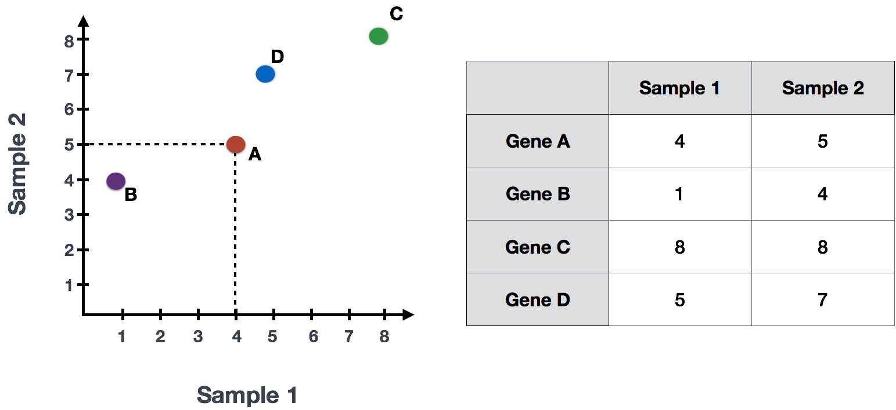

# Data integration and clustering

## A typical single cell RNA-seq analysis workflow
After filtering cells using QC metrics, we need to cluster the cells based on gene expression similarity. Before clustering, we might need to perform another step "integration". We will determine whether integration is necessary or not by first clustering without integration.

 <p align="center">

</p>

***
_**Goals of this lesson:**_ 
 
 - _To **generate cell type-specific clusters** and use known cell type marker genes to determine the identities of the clusters._
 - _To **determine whether clusters represent true cell types or cluster due to biological or technical variation**, such as clusters of cells in the S phase of the cell cycle, clusters of specific batches, or cells with high mitochondrial content._

_**Challenges:**_
 
 - _**Identifying poor quality clusters** that may be due to uninteresting biological or technical variation_
 - _**Identifying the cell types** of each cluster_
 - _Maintaining patience as this can be a highly iterative process between clustering and marker identification (sometimes even going back to the QC filtering)_

_**Recommendations:**_
 
 - _Have a good idea of your expectations for the **cell types to be present** prior to performing the clustering. Know whether you expect cell types of low complexity or higher mitochondrial content AND whether the cells are differentiating_
 - _If you have **more than one condition**, it's often helpful to perform integration to align the cells_
 - _**Regress out** number of UMIs (by default with sctransform), mitochondrial content, and cell cycle, if needed and appropriate for experiment, so not to drive clustering_
 - _Identify any junk clusters for removal or re-visit QC filtering. Possible junk clusters could include those with high **mitochondrial content** and low UMIs/genes. If comprised of a lot of cells, then may be helpful to go back to QC to filter out, then re-integrate/cluster._
 - _If **not detecting all cell types as separate clusters**, try changing the resolution or the number of PCs used for clustering_
 
***

### Copy the input file and load packages
In the "1_Data_loading_and_QC_filtering" folder, you will find the "data_filtered.rds" file. Copy that file to this folder ("2_Integration_and_Clustering").

    scRNAseq_analysis                         
       ├──0_Install_R_packages_and_check.Rmd
       ├──1_Human_PDAC_tissue 
       │   │                                  
       │   ├── 1_Data_loading_and_QC_filtering
       │   │    ├──PDAC_tissue_1_filtered_feature_bc_matrix
       │   │    ├──PDAC_tissue_2_filtered_feature_bc_matrix
       │   │    ├──PDAC_tissue_3_filtered_feature_bc_matrix
       │   │    ├──PDAC_tissue_4_filtered_feature_bc_matrix
       │   │    ├──1_data_loading_and_QC_filtering.Rmd
       │   │    ├──data_filtered.rds**
       │   │    ├──data_merged.rds
       │   │    ├──data_preliminary_clustered.rds
       │   │    └──Figures
       │   │
       │   ├──2_Integration_and_Clustering    
       │   └──3_Data_Visualization
       │   
       └── 2_Human_PDAC_PBMC


### Load required packages

Run chunk 1 to load the required libraries
```
library(XVector)
library(Seurat)
library(tidyverse)
library(Matrix)
library(RCurl)
library(scales)
library(sctransform)
```
_Note: If you have not installed the packages yet, then install them first before loading._

### Load the filtered seurat object (data_filtered.rds)
Read in the filtered data by running chunk 2. The readRDS() function used in this chunk can read in R objects that were previously created.

```
data.filtered <- readRDS ("data_filtered.rds")
```
Let's take a look at the data to make sure everything looks good"


```
> head(data.filtered)
                      orig.ident nCount_RNA nFeature_RNA      S.Score    G2M.Score Phase  percent.MT percent.RIBO
H1_AAACGAAGTCATAGTC-1    Human-1      72725         7990 -0.056463192 -0.087881120    G1 14.34994844    14.304572
H1_AAAGAACCATTAAAGG-1    Human-1      12734         4046 -0.020854275 -0.100676194    G1  3.68305324     8.002199
H1_AAAGGATTCGGCTTGG-1    Human-1       5653         2200 -0.015267656  0.003957696   G2M  3.29028834    19.051831
H1_AAAGGGCAGTAGCAAT-1    Human-1      20289         4772 -0.079636793 -0.120778876    G1  5.86524718     9.428754
H1_AAAGGGCAGTGAATAC-1    Human-1      50408         6714 -0.054380550 -0.092793537    G1  6.21925091    18.729170
H1_AACAACCGTTGCCTAA-1    Human-1      18025         2016 -0.001272634 -0.049945061    G1  0.03883495    34.452150
H1_AACAAGAGTGTATCCA-1    Human-1      24244         6228 -0.064505132 -0.106257050    G1  0.75482594     7.597756
H1_AACAAGATCCATGAGT-1    Human-1      14398         3920 -0.050772605 -0.050942010    G1  5.36185581    15.106265
H1_AACCAACAGCGCTTCG-1    Human-1      75830         8602 -0.074791198 -0.102485391    G1  8.76170381    16.835026
H1_AACCAACCACTGGCCA-1    Human-1      19708         4857  0.522360640  0.924381183   G2M  5.97219403    10.031459
```


## Normalization
An essential first step in the majority of mRNA expression analyses is normalization, whereby systematic variations are adjusted for to **make expression counts comparable across genes and/or samples**. The counts of mapped reads for each gene is proportional to the expression of RNA ("interesting") in addition to many other factors ("uninteresting"). Normalization is the process of adjusting raw count values to account for the "uninteresting" factors. The main factors often considered during normalization are: sequencing depth and gene length.

### Methods for scRNA-seq normalization

Various methods have been developed specifically for scRNA-seq normalization. Some **simpler methods resemble what we have seen with bulk RNA-seq**; the application of **global scale factors** adjusting for a count-depth relationship that is assumed common across all genes. However, if those assumptions are not true then this basic normalization can lead to over-correction for lowly and moderately expressed genes and, in some cases, under-normalization of highly expressed genes ([Bacher R et al, 2017](https://www.ncbi.nlm.nih.gov/pmc/articles/PMC5473255/)). **More complex methods will apply correction on a per-gene basis.** In this lesson we will explore both approaches.


**Simple transformations** are those which apply the same function to each individual measurement. Common examples include a **log transform** (which is applied in the original Seurat workflow), or a square root transform (less commonly used). In the [Hafemeister and Satija, 2019 paper](https://genomebiology.biomedcentral.com/articles/10.1186/s13059-019-1874-1) the authors explored the issues with simple transformations. Specifically they evaluated the standard log normalization approach and found that genes with different abundances are affected differently and that **effective normalization (using the log transform) is only observed with low/medium abundance genes. Additionally, **substantial imbalances in variance were observed with the log-normalized data**. That means **we cannot treat all genes the same.**

The proposed solution was the use of **Pearson residuals for transformation**, as implemented in Seurat's `SCTransform` function. With this approach:
* Measurements are multiplied by a gene-specific weight
* Each gene is weighted based on how much evidence there is that it is non-uniformly expressed across cells
* More evidence == more of a weight; Genes that are expressed in only a small fraction of cells will be favored (useful for finding rare cell populations)
* Not just a consideration of the expression level is, but also the distribution of expression

_In this lesson we will primarily use the "SCTransform" function of seurat to normalize the data. Note that this single _SCTransform()_ command replaces _NormalizeData(), ScaleData(), and FindVariableFeatures()_ commands of the original Seurat workflow which performs the log-normalization.


## Clustering cells based on top Principal components (PCs)

### Principal Component Analysis (PCA)
Principal Component Analysis (PCA) is a technique used to emphasize variation as well as similarity, and to bring out strong patterns in a dataset; it is one of the methods used for *"dimensionality reduction"*. We will briefly go over PCA in this lesson (adapted from StatQuests/Josh Starmer's YouTube video), but we strongly encourage you to explore the video [StatQuest's video](https://www.youtube.com/watch?v=_UVHneBUBW0) for a more thorough explanation/understanding. 

#### Basic explanation with a simple example

Let's say you had quantified the expression of four genes in two samples (or cells), you could plot the expression values of those genes with one sample represented on the x-axis and the other sample on the y-axis as shown below:

<p align="center">

</p>

You could draw a line through the data in the direction representing the **most variation**, which is on the diagonal in this example. The maximum variation in the dataset is between the genes that make up the two endpoints of this line.  

We also see the genes vary somewhat above and below the line. We could draw another line through the data representing **the second most amount of variation** in the data, since this plot is in 2D (2 axes).

The genes near the ends of each line would be those with the highest variation; these genes have the **greatest influence** on the direction of the line, mathematically. For example, a small change in the value of *Gene C* would greatly change the direction of the longer line, whereas a small change in *Gene A* or *Gene D* would have little affect on it.

<p align="center">

</p>


We could also rotate the entire plot and view the lines representing the variation as left-to-right and up-and-down. We see most of the variation in the data is left-to-right (longer line) and the second most variation in the data is up-and-down (shorter line). You can now think of these lines as the axes that represent the variation. These axes are essentially the "Principal Components", with PC1 representing the most variation in the data and PC2 representing the second most variation in the data. 

<p align="center">

</p>

Now, what if we had three samples/cells, then we would have an extra direction in which we could have variation (3D). Therefore, if we have *N* samples/cells we would have *N*-directions of variation or *N* principal components (PCs)! Once these PCs have been calculated, the PC that deals with the largest variation in the dataset is designated PC1, and the next one is designated PC2 and so on. 


