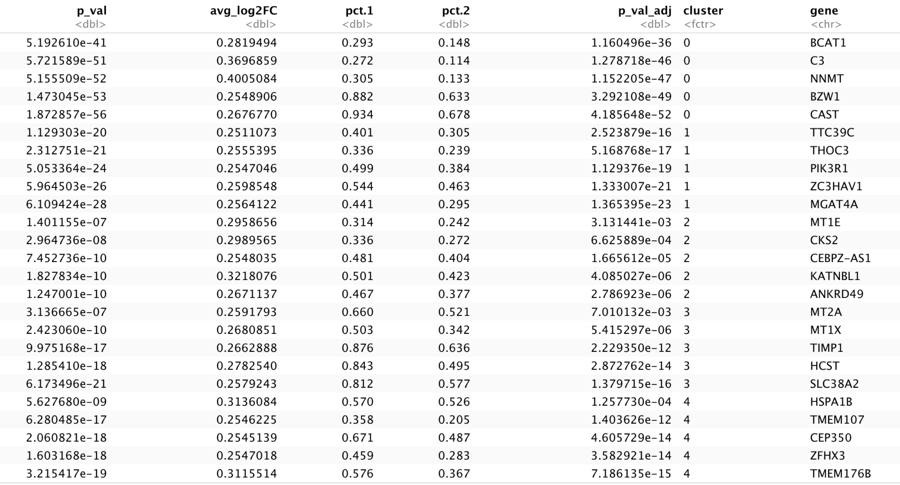
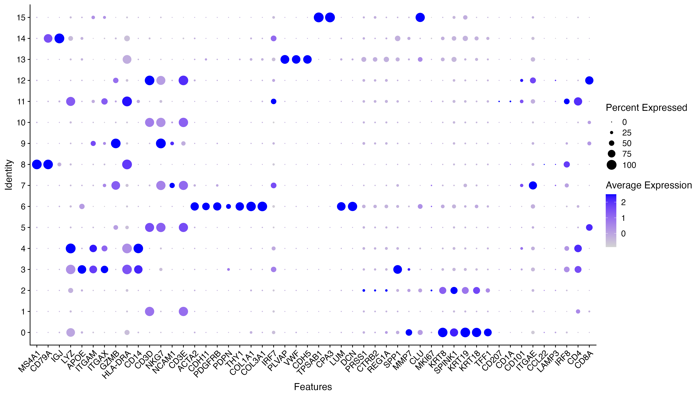
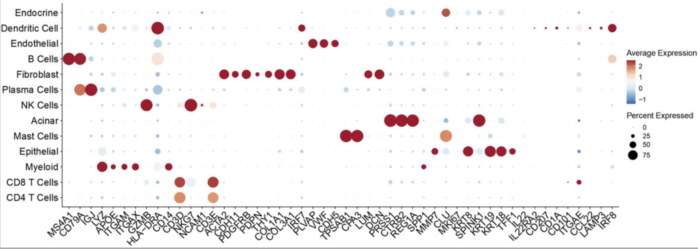
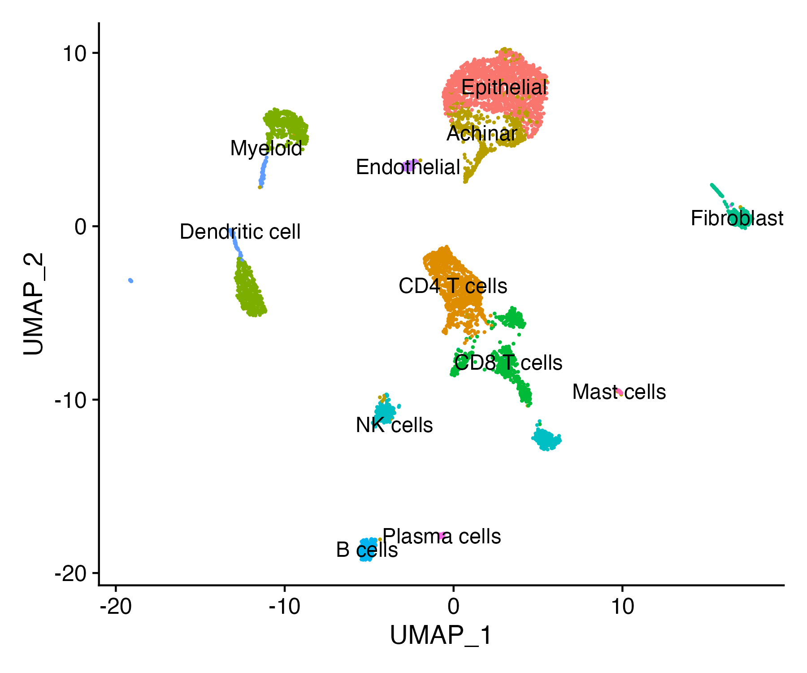
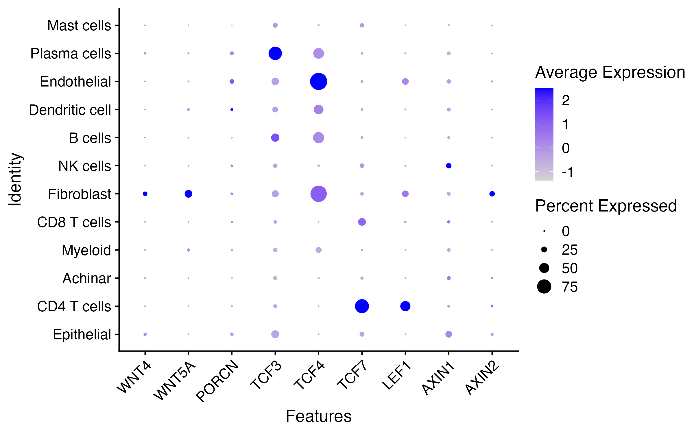
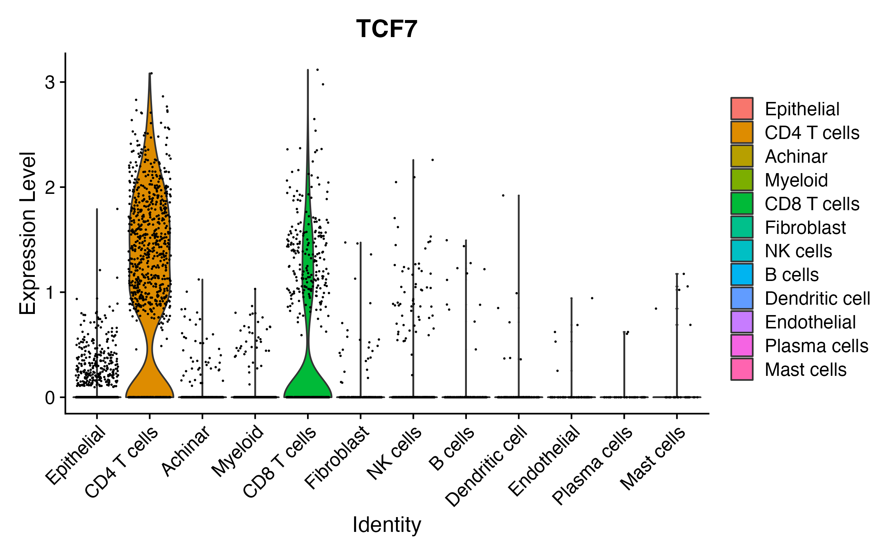

# Data visualization and Interpretation

## A typical single-cell RNA-seq analysis workflow
Now that we have identified our desired clusters, we can move on to marker identification, which will allow us to verify the identity of certain clusters and help surmise the identity of any unknown clusters.
 <p align="center">

</p>

***

_**Goals:**_ 
 
 - _To **determine the gene markers** for each of the clusters_
 - _To **identify cell types** of each cluster using markers_
 - _To determine whether there's a need to **re-cluster based on cell type markers**, perhaps clusters need to be merged or split_

_**Challenges:**_
 
 - _Over-interpretation of the results_
 - _Combining different types of marker identification_

_**Recommendations:**_
 
 - _Think of the results as hypotheses that need verification. Inflated p-values can lead to over-interpretation of results (essentially each cell is used as a replicate). Top markers are most trustworthy._
 - _Identify all markers conserved between conditions for each cluster_
 - _Identify markers that are differentially expressed between specific clusters_

***

### Copy the input file to the analysis folder
In the "2_Integration_and_Clustering" folder, you will find the "data_clust_integrated.rds" file. Copy that file to this folder ("3_Data_visualization").

In the "3_Data_visualization" folder, you will find the **3_Data_visualization.Rmd** R markdown file. Open the R markdown file and run each chunk sequentially.


    scRNAseq_analysis                         
       ├──0_Install_R_packages_and_check.Rmd
       ├──1_Human_PDAC_tissue 
       │   │                                  
       │   ├── 1_Data_loading_and_QC_filtering
       │   │ 
       │   │
       │   ├──2_Integration_and_Clustering**  
       │   │    ├──2_data_integration_and_clustering.Rmd
       │   │    ├──data_clust_integrated.rds**
       │   │    ├──data_clust_no_integration.rds
       │   │    ├──data_filtered.rds
       │   │    ├──data.integrated.rds
       │   │    ├──data_filtered.rds
       │   │    └──Figs
       │   │ 
       │   └──3_Data_Visualization**
       │        └──3_Data_Visualization.rmd
       │   
       └── 2_Human_PDAC_PBMC
In case you DO NOT have the "data_clust_integrated.rds" file in your "2_Integration_and_Clustering" folder, you can copy a pre-made "data_clust_integrated.rds" file to your "3_Data_visualization" folder from the shared directory. First navigate to the "3_Data_Visualization" folder and run the following:

```bash
cp /gpfs1/cl/mmg232/course_materials/data_clust_integrated.rds data_clust_integrated.rds
```

### Load required packages

Run chunk 1 to load the required libraries:

```r
library(XVector)
library(Seurat)
library(tidyverse)
library(Matrix)
library(RCurl)
library(scales)
library(sctransform)
```

### Load the integrated clustered seurat object (data_clust_integrated.rds) 
Read in the filtered data by running chunk 2. The readRDS() function used in this chunk can read in R objects that were previously created.

```r
data_clust_integrated <- readRDS ("data_clust_integrated.rds")

# Visualize the clustered (integrated) cells
DimPlot(data_clust_integrated, reduction = "umap", label = TRUE) + NoLegend()

# Save the plot
ggsave(path = "Figs", filename = "Clusters_integrated.png",  height=5, width=6, units='in', dpi = 300, bg = "transparent", device='png')
```
<p align="center">

</p>

### Find markers for each cluster
Run chunk 3 to find markers for every cluster compared to all remaining cells. Report only the positive ones.

```r
DefaultAssay(data_clust_integrated)  <- "RNA"
Idents(data_clust_integrated) <- "seurat_clusters"
data_markers <- FindAllMarkers(data_clust_integrated, only.pos = TRUE, min.pct = 0.25, logfc.threshold = 0.25)
data_markers %>%
    group_by(cluster) %>%
    slice_max(n = 5, order_by = p_val)
```

<p align="center">

</p>

### Make a dot plot
Run chunk 4 to make a dotplot representing each cluster's expression of selected genes
The gene list was selected based on the Figure S1B of our paper of interest (Du et al., 2022).

```r
DefaultAssay(data_clust_integrated)  <- "RNA"
# Select features (genes) to look at:
FEATURES <- c("MS4A1","CD79A","IGJ","LYZ","APOE","ITGAM","ITGAX","GZMB","HLA-DRA","CD14","CD3D",
              "NKG7","NCAM1","CD3E","ACTA2","CDH11","PDGFRB","PDPN","THY1","COL1A1","COL3A1",
              "IRF7","PLVAP","VWF","CDH5","TPSAB1","CPA3","LUM","DCN","PRSS1","CTRB2","REG1A",
              "SPP1","MMP7","CLU","MKI67","KRT8","SPINK1","KRT19","KRT18","TFF1","IL22","IL22RA2",
              "CD207","CD1A","CD101","ITGAE","CCL22","LAMP3","IRF8",
              "CD4","CD8A")
              

# Dot plots - the size of the dot corresponds to the percentage of cells expressing the
# feature in each cluster. The color represents the average expression level
DotPlot(data_clust_integrated, features = FEATURES)+RotatedAxis()

# Save the dot plot
ggsave(path = "Figs", filename = "Human_PDAC_clustered_gene_dotplot.png",  height=8, width=14, units='in', dpi = 300, bg = "transparent", device='png')
```

The resulting dot plot has selected gene names on X-axis and cluster IDs on Y-axis:
<p align="center">

</p>

Now, let's compare our dot plot with the one shown in the paper (Figure S1B). Please note that the Y-axis in Figure S1B shows specific cell types instead of cluster IDs.

<p align="center">

</p>

To make a similar dot plot with cell types, we need to assign one or more cluster IDs to specific cell types. This step is time-consuming and requires detailed knowledge of the cell types involved. As we have neither time nor expertise, let's use the Figure S1B gene expression profile as a reference for renaming our cluster IDs to specific cell types. 


### Rename clusters based on the gene expression profile
Run chunk 5 to rename the clusters to specific cell types based on their gene expression profile (Figure S1B). Here we will use the **RenameIdents()** function of Seurat.

```r
DefaultAssay(data_clust_integrated)  <- "integrated"
Idents(data_clust_integrated) <- "seurat_clusters"
levels(data_clust_integrated) <- c("0","1","2","3","4","5","6","7","8","9","10","11","12","13","14","15")
current.ids = c("0","1","2","3",
                "4","5","6","7",
                "8","9","10","11",
                "12","13","14","15")
new.cluster.ids = c("Epithelial","CD4 T cells","Achinar","Myeloid",
                    "Myeloid","CD8 T cells","Fibroblast","NK cells",
                    "B cells","NK cells","CD8 T cells","Dendritic cell",
                    "CD8 T cells","Endothelial","Plasma cells","Mast cells")
names(new.cluster.ids) <- levels(data_clust_integrated)
data_clust_integrated_rename <- RenameIdents(object = data_clust_integrated, new.cluster.ids)

# Add new.cluster.ids as a new column in metadata
new_cluster_ids <- data_clust_integrated_rename@active.ident
data_clust_integrated_rename <- AddMetaData(data_clust_integrated_rename, metadata=new_cluster_ids, col.name = "new_cluster_ids")

# Visualize the clustered (renamed) cells
DimPlot(data_clust_integrated_rename, reduction = "umap", label = TRUE) + NoLegend()

# Save the plot
ggsave(path = "Figs", filename = "Clusters_integrated_renamed.png",  height=5, width=6, units='in', dpi = 300, bg = "transparent", device='png')
```
<p align="center">

</p>

Run chunk 6 to save the renamed clustered file:
```r
saveRDS(data_clust_integrated_rename, "data_clustered_integrated_renamed.rds")
```

### Plot the expression of WNT components
As WNT signaling potentially plays essential roles in the tumor microenvironment (TME) of pancreatic ductal adenocarcinoma (PDAC)(review [slide](https://github.com/SomenMistri/intro_to_scRNA-seq/blob/main/Slides/Study_design.pptx)), let's take a look at the expression of WNT signaling components in this dataset:

First, run chunk 7 to select canonical features of the WNT signaling pathway.

```r
DefaultAssay(data_clust_integrated_rename)  <- "RNA"
#Now select features
FEATURES <- c("WNT4","WNT5A","PORCN","TCF3","TCF4","TCF7","LEF1","AXIN1","AXIN2")
```
Run chunk 8 to Make a dot plot of selected features:

```r
DotPlot(data_clust_integrated_rename, features = FEATURES)+RotatedAxis()

# Save the plot
ggsave(path = "Figs", filename = "Human_PDA_clustered_WTN_dotplot.png",  height=5, width=8, units='in', dpi = 300, bg = "transparent", device='png')
```

<p align="center">

</p>

Interestingly, we can see the expression of WNT components in epithelial cells, as expected, and **other populations** across the tumor microenvironment. In particular, we can find expression of WNT components in tumor-infiltrating lymphocytes (TILs).

Next, let's focus specifically on TCF7, which encodes for the TCF1 protein, a transcription factor and mediator of WNT signaling that plays an essential role in T cell differentiation. Previously, in the context of cancer, the role of Tcf7 has been investigated in CD8 T cells but not in CD4 T cells. A violin plot of TCF7 expression levels across cell types shows that the expression of TCF7 is both highest and most abundant in CD4+ T cells, followed by CD8+ T cells in PDAC.

<p align="center">

</p>

To functionally dissect the role of CD4 T cell Tcf7 in pancreatic cancer, the authors then generated a special mouse line where Tcf7 can be conditionally inactivated in CD4-expressing T cells. Please go to this [slide](../Slides/Study_design.pptx) to further discuss the results of this study.

                                             ---------------------------------
                                             ---------------END---------------
                                             ---------------------------------


****
### Citation

To cite material from this course in your publications, please use:

> Jihe Liu, William J. Gammerdinger, Meeta Mistry, Mary E. Piper, & Radhika S. Khetani. (2022, January 6). hbctraining/Intro-to-shell-flipped: Shell and HPC Lessons from HCBC (first release). Zenodo. https://doi.org/10.5281/zenodo.5826091

A lot of time and effort went into the preparation of these materials. Citations help us understand the needs of the community, gain recognition for our work, and attract further funding to support our teaching activities. Thank you for citing this material if it helped you in your data analysis.

---
These materials have been developed by members of the teaching team at the [Harvard Chan Bioinformatics Core (HBC)](http://bioinformatics.sph.harvard.edu/). These are open access materials distributed under the terms of the [Creative Commons Attribution license](https://creativecommons.org/licenses/by/4.0/) (CC BY 4.0), which permits unrestricted use, distribution, and reproduction in any medium, provided the original author and source are credited.

Some materials used in these lessons were derived from work that is Copyright © Data Carpentry (http://datacarpentry.org/). 
All Data Carpentry instructional material is made available under the [Creative Commons Attribution license](https://creativecommons.org/licenses/by/4.0/) (CC BY 4.0).
****
