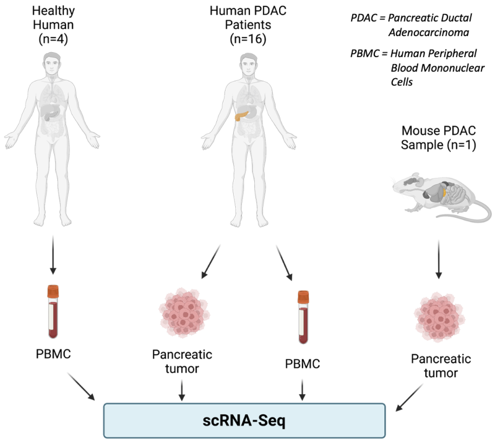
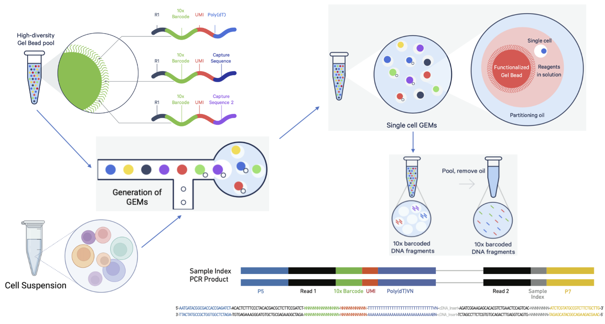
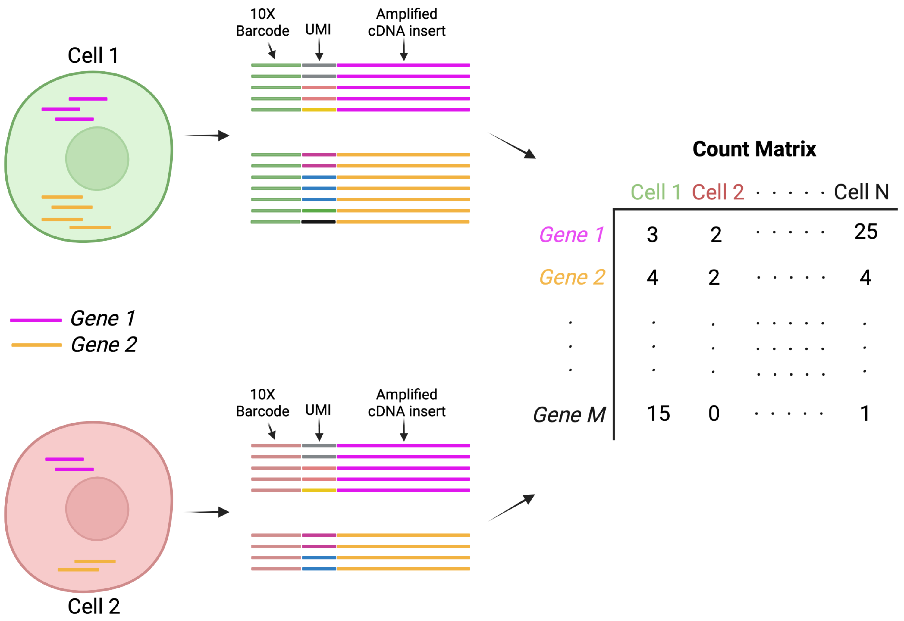

# Day 1

## Why single-cell RNA-seq

Across human tissues, there is an incredible diversity of cell types, states, and interactions. To better understand these tissues and the cell types present, single-cell RNA-seq (scRNA-seq) offers a glimpse into what genes are being expressed at the level of individual cells.

<p align="center">

</p>

_**Image credit:** courtesy of Dr. Ayshwarya Subramanian_

The single-cell RNA-seq (scRNA-seq) offers significant advantages over the bulk RNA-seq approach while investigating heterogeneous populations of cells. Before scRNA-seq, transcriptome analysis was performed using bulk RNA-seq, a straightforward method for comparing the averages of cellular expression. This method can be a good choice if looking at comparative transcriptomics (e.g., samples of the same tissue from different species) and for quantifying expression signatures in disease studies. It also has the potential for discovering disease biomarkers if you are not expecting or concerned about cellular heterogeneity in the sample. Two scenarios where scRNA-seq outperforms bulk RNA-seq are shown below: 

<p align="center">

</p>

While bulk RNA-seq can explore differences in gene expression between conditions (e.g., treatment or disease), the differences at the cellular level need to be adequately captured. For instance, in the images below, if analyzed in bulk (left), we would not detect the correct association between the expression of gene A and gene B. However, if we properly group the cells by cell type or cell state, we can see the correct correlation between the genes.

<p align="center">

</p>

_**Image credit:** Trapnell, C. Defining cell types and states with single-cell genomics, Genome Research 2015 (doi:
https://dx.doi.org/10.1101/gr.190595.115)_

This exciting and cutting-edge scRNA-seq method can be used to:

- explore which cell types are present in a tissue
- identify unknown/rare cell types or states
- elucidate the changes in gene expression during differentiation processes or across time or states
- identify genes that are differentially expressed in particular cell types between conditions (e.g., treatment or disease)
- explore changes in expression among a cell type while incorporating spatial, regulatory, and/or protein information

## Let's analyze a publicly available scRNA-seq dataset
To understand and perform scRNA-seq data analysis, let's use a publicly available dataset with a specific research goal. Please click this [link](https://rupress.org/jem/article/220/1/e20220503/213546/WNT-signaling-in-the-tumor-microenvironment) to go to the journal webpage.

Alternatively, you can access the main text along with the supplemental data (IMPORTANT!!) by clicking [here](https://github.com/SomenMistri/intro_to_scRNA-seq/blob/main/pdf/Article_WNT_signaling_Pancreatic_cancer.pdf).

The human scRNA-seq datasets (count matrices prepared from raw FASTQ data) utilized by the authors are available [here](https://www.ncbi.nlm.nih.gov/geo/query/acc.cgi?acc=GSE155698),
while the mouse scRNA-seq datasets are available [here](https://www.ncbi.nlm.nih.gov/geo/query/acc.cgi?acc=GSM6127792).

Please note that, for this course, we will focus on human scRNA-seq datasets only.

## Research question and study design
Please go to the PowerPoint [slide](https://github.com/SomenMistri/intro_to_scRNA-seq/blob/main/Slides/Study_design.pptx) to discuss the background and specific research question(s).

In order to decipher the role of WNT signaling in the tumor microenvironment (TME)of Pancreatic ductal adenocarcinoma (PDAC), this research group performed scRNA-Seq of pancreatic tumor cells and PBMCs originating from human and mouse sources.

<p align="center">

</p>

## How scRNA-Seq works: From cell suspension to sequencing-ready libraries 
Depending on the library preparation method used, the RNA sequences (also referred to as reads or tags) will be derived either from the 3' ends (or 5' ends) of the transcripts (10X Genomics, CEL-seq2, Drop-seq, inDrops) or full-length transcripts (Smart-seq). The choice of the method involves the biological question of interest.

This class will primarily focus on the 3’-end sequencing method utilized by 10X Genomics.

The 10X Genomics chromium system performs a single-cell droplet-based encapsulation using a gel bead-in-emulsion (GEM) approach. In the instrument, barcoded gel beads are mixed with cells, enzymes, and partitioning oil forming numerous GEMs. Each GEM acts as a micro-reaction droplet where the gel beads dissolve, and RNA transcripts from each cell get barcoded. The barcoded fragments are pooled, and sequencer–compatible libraries are created. 

 <p align="center">

</p>

_**Image credit:** adapted from 10x Genomics brochure_
 
 ## Raw sequencing data to count matrix
 Following sequencing, the raw read data (FASTQ) is converted into a count matrix using the cellular 10xBarcode and Unique Molecular Identifier (UMI) information imparted in each read. While the cellular 10xBarcode determines which cell the read originated from, the UMI determines which transcript molecule the read originated from. Thus, UMIs distinguish biological duplicates from amplification (PCR) duplicates. 
  <p align="center">

</p>
 
 This whole process of raw data (FASTQ files) to count matrix can be easily performed using the 10x Genomics Cell Ranger analysis pipeline. This step is computationally very intensive as this involves read alignment to a reference genome. Therefore, this Cell Ranger pipeline needs to be run in VACC. In this class, we will skip this step to save time and start with pre-made 10x Cell Ranger outputs (count matrixes).
 
Instruction on how to install and run the cellranger pipeline can be accessed through this [link](https://support.10xgenomics.com/single-cell-gene-expression/software/pipelines/latest/what-is-cell-ranger).

### A typical raw data directory layout

       Magliano_10x_raw_data_human                          # Main folder provided by the sequencing core
       ├── PDAC_TISSUE_1
       ├── PDAC_TISSUE_2                                    # Subfolder marking individual samples
       │   ├── PDAC_TISSUE_2_C7_1_S9_L001_R1_001.fastq.gz   # FASTQ file Read 1
       │   └── PDAC_TISSUE_2_C7_1_S9_L001_R2_001.fastq.gz   # FASTQ file Read 2
       ├── PDAC_TISSUE_3               
       ├── PDAC_TISSUE_4
       ├── PDAC_PBMC_1  
       ├── PDAC_PBMC_2
       ├── PDAC_PBMC_3               
       └── PDAC_PBMC_4
       
### A typical "Cell Ranger count" run in VACC

```
#------------------------------------------------------------
#!/bin/bash
# Set Partition
#SBATCH  --partition=bigmem
# Request nodes
#SBATCH --nodes=1
# Request some processor cores
#SBATCH --ntasks=12
# Request memory
#SBATCH --mem=192G
# time
#SBATCH --time 16:00:00
# Name of this job
#SBATCH --job-name=PDAC_human
# Output of this job, stderr and stdout are joined by default
# %x=job-name %j=jobid
#SBATCH --output=%x_%j.out
# Notify me via email -- please change the username!
#SBATCH --mail-user=username@uvm.edu
#SBATCH --mail-type=ALL
#------------------------------------------------------------

# navigate to the folder where you want the analysis to happen
cd /username/scRNAseq/

cellranger count --id= PDAC_human_10x \
                 --transcriptome=/username/reference_sequences/cellranger_references/refdata-gex-GRCh38-2020-A.tar.gz \
                 --fastqs=/username/scRNAseq/Magliano_10x_raw_data_human \
                 --sample= PDAC_TISSUE_1_C6_1, PDAC_TISSUE_2_C7_2, PDAC_TISSUE_3_C8_3, PDAC_TISSUE_4_C9_4 \
                 --expect-cells=6000 \
                 --jobmode=local \
                 --localcores=12 \
                 --localmem=14
                 
 ```   
 
              
### A typical "Cell Ranger count" output looks like this:
    PDAC_human_10x                                      
        └── outs                                          
            ├── filtered_feature_bc_matrix     #this is the folder you need for downstream R analysis
            │   ├── barcodes.tsv.gz
            │   ├── features.tsv.gz
            │   └── matrix.mtx.gz
            ├── filtered_feature_bc_matrix.h5  #Alternatively, this file can also be used as a input for downstream R analysis
            ├── raw_feature_bc_matrix        
            └── raw_feature_bc_matrix.h5        


## A typical single cell RNA-seq analysis workflow
After quantifying gene expression from raw sequencing reads, we need to bring the count matrix data (filtered_feature_bc_matrix) into R to generate metrics for performing QC and further downstream analysis.

 <p align="center">

</p>


## Homework (important for Day 2!!)

### Getting ready with the count matrix and R markdown files for Day 2
First, log in to  your VACC account. Copy the scRNAseq_analysis.tar file from the shared folder to your home directory. This .tar file contains the count matrix files as well as the necessary R markdown files (.Rmd) required for this tutorial.

```
cp -r /gpfs1/cl/mmg232/course_materials/scRNAseq_analysis.tar
```

Then, extract the .tar file in your home directory. You should see a new folder named "scRNAseq_analysis" in your home directory. 
```
tar -xvf scRNAseq_analysis.tar
```

### Launching a RStudio Server session on UVM VACC Open OnDemand
Log into UVM VACC Open OnDemand [website](https://vacc-ondemand.uvm.edu/). Click on the "Rstudio Server" option from the "Interactive Apps" dropdown menu. Click on launch with the default options. Your job request should be on queue for a brief moment before starting the session. Click on "Connect to Rstudio Server" icon" to start.

On your lower right hand side, you should see the files of your home directory. Please click the "scRNAseq_analysis" folder icon. You should see the following folder structure:

    scRNAseq_analysis                         
       ├──0_Install_R_packages_and_check.Rmd
       ├──1_Human_PDAC_tissue                                   
       │   ├── 1_QC_filtering_and_clustering
       │   │    ├──PDAC_tissue_1_filtered_feature_bc_matrix
       │   │    ├──PDAC_tissue_2_filtered_feature_bc_matrix
       │   │    ├──PDAC_tissue_3_filtered_feature_bc_matrix
       │   │    ├──PDAC_tissue_4_filtered_feature_bc_matrix
       │   │    └──1_QC_filtering_and_first_pass_clustering.Rmd
       │   ├──2_integration_and_clustering    
       │   └──3_data_visualization
       │   
       └── 2_Human_PDAC_PBMC
         
               


### Install required R packages and check whether the installation is a success

Please navigate to the "/scRNAseq_analysis/0_QC_filtering_and_clustering" folder and click on the 0_Install_R_packages_and_check.Rmd file. The R markdown file can also be found [here](https://github.com/SomenMistri/intro_to_scRNA-seq/blob/main/scripts/1_Install_R_packages_and_check.Rmd).

You can also install these packages by copying and pasting the code chunks into Rstudio console.

> **Note 1:**  All the package names listed in the R markdown file are case sensitive!**
 
> **Note 2:** At any point (especially if you’ve used R/Bioconductor in the past), in the console **R may ask you if you want to update any old packages by asking Update all/some/none? [a/s/n]:**. If you see this, **type "a" at the prompt and hit Enter** to update any old packages. _Updating packages can sometimes take quite a bit of time to run, so please account for that before you start with these installations._  

> **Note 3:** If you see a message in your console along the lines of “binary version available but the source version is later”, followed by a question, **“Do you want to install from sources the package which needs compilation? y/n”, type n for no, and hit enter**.

 Run the first chunk (**chunk 1**) to install R packages Bioconductor using the the `BiocManager::install()` function.
```
if (!require("BiocManager", quietly = TRUE))
    install.packages("BiocManager")
BiocManager::install("XVector",force = TRUE)
BiocManager::install("multtest")
BiocManager::install("glmGamPoi")
```

Now run the second chunk (**chunk 2**) to install packages listed below from **CRAN** using the `install.packages()` function. 
```
install.packages('tidyverse')
install.packages('Matrix')
install.packages('RCurl')
install.packages('scales')
install.packages('metap')
install.packages('Seurat')
install.packages("ggplot2")
install.packages("sctransform")
```

Finally, please check that all the packages were installed successfully by **loading** them using the `library()` function (**chunk 3**).
```
library(XVector)
library(Seurat)
library(tidyverse)
library(Matrix)
library(RCurl)
library(scales)
library(sctransform)
```
If there are no errors in loading the packages, then installation was a success and we are ready for day 2. You can now close this R markdown file and end the  RStudio session.  