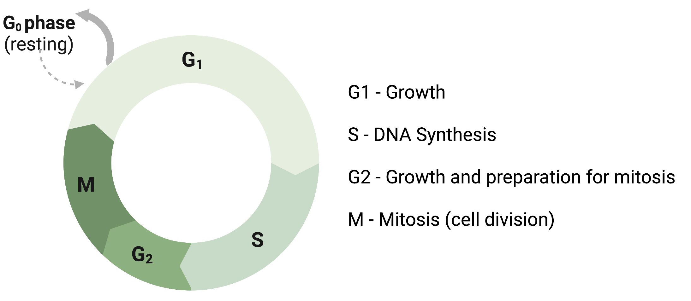
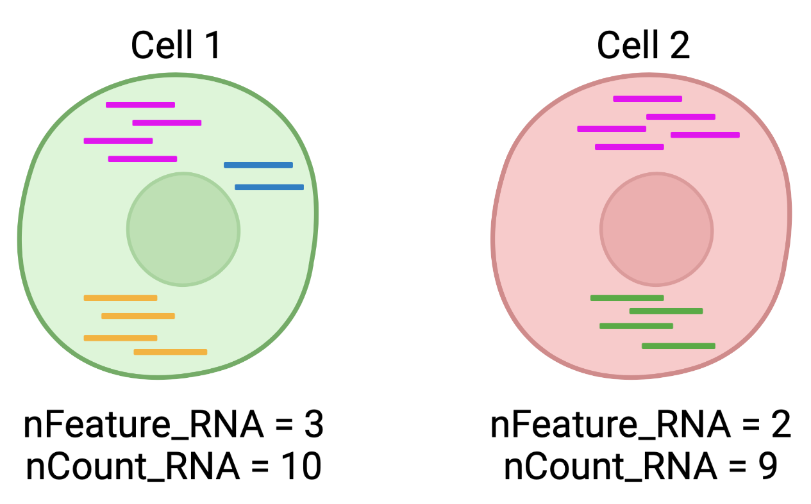
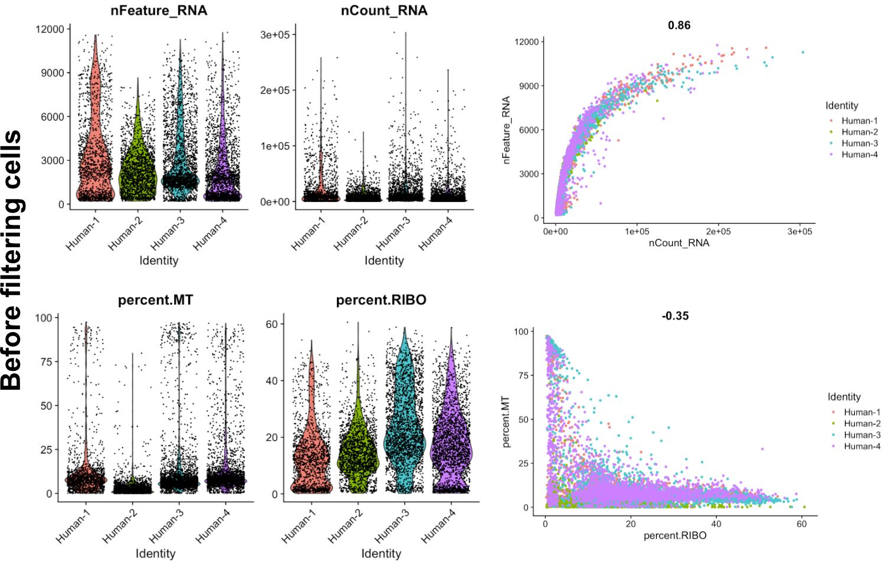
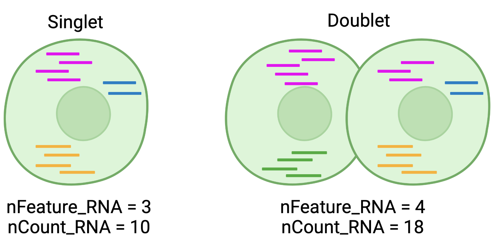

# Data input and QC filtering of scRNA-Seq data

## A typical single cell RNA-seq analysis workflow
After quantifying gene expression from raw sequencing reads, we need to bring the count matrix data (filtered_feature_bc_matrix) into R to generate metrics for performing QC and further downstream analysis.

 <p align="center">

</p>

***

Each step of this workflow has its own goals and challenges. For QC of our raw count data, they include:

_**Goals:**_ 
 
 - _To **filter the data to only include true cells that are of high quality**, so that when we cluster our cells it is easier to identify distinct cell type populations_
 - _To **identify any failed samples** and either try to salvage the data or remove from analysis, in addition to, trying to understand why the sample failed_

_**Challenges:**_
 
 - _Delineating cells that are **poor quality from less complex cells**_
 - _Choosing appropriate thresholds for filtering, so as to **keep high quality cells without removing biologically relevant cell types**_

_**Recommendations:**_
 
 - _Have a good idea of your expectations for the **cell types to be present** prior to performing the QC. For instance, do you expect to have low complexity cells or cells with higher levels of mitochondrial expression in your sample? If so, then we need to account for this biology when assessing the quality of our data._

***


### Getting ready with the count matrix and R markdown files
First, log in to  your VACC account. Copy the scRNAseq_analysis.tar file from the shared folder to your home directory. This .tar file contains the count matrix files as well as the necessary R markdown files (.Rmd) required for this tutorial.

```
cp -r /gpfs1/cl/mmg232/course_materials/scRNAseq_analysis.tar
```

Then, extract the .tar file in your home directory. You should see a new folder named "scRNAseq_analysis" in your home directory. 

```
tar -xvf scRNAseq_analysis.tar
```

### Launching a RStudio Server session on UVM VACC Open OnDemand
Log into UVM VACC Open OnDemand [website](https://vacc-ondemand.uvm.edu/). Click on the "Rstudio Server" option from the "Interactive Apps" dropdown menu. Click on launch with the default options. Your job request should be on queue for a brief moment before starting the session. Click on "Connect to Rstudio Server" icon" to start.

On your lower right hand side, you should see the files of your home directory. Please click the "scRNAseq_analysis" folder icon. You should see the following folder structure:

    scRNAseq_analysis                         
       ├──0_Install_R_packages_and_check.Rmd
       ├──1_Human_PDAC_tissue 
       │   │                                  
       │   ├── 1_Data_loading_and_QC_filtering
       │   │    ├──PDAC_tissue_1_filtered_feature_bc_matrix
       │   │    ├──PDAC_tissue_2_filtered_feature_bc_matrix
       │   │    ├──PDAC_tissue_3_filtered_feature_bc_matrix
       │   │    ├──PDAC_tissue_4_filtered_feature_bc_matrix
       │   │    └──1_data_loading_and_QC_filtering.Rmd
       │   │
       │   ├──2_Integration_and_Clustering    
       │   └──3_Data_Visualization
       │   
       └── 2_Human_PDAC_PBMC
         
               


### Install required R packages and check whether the installation is a success

Please navigate to the "/scRNAseq_analysis/0_QC_filtering_and_clustering" folder and click on the 0_Install_R_packages_and_check.Rmd file. The R markdown file can also be found [here](https://github.com/SomenMistri/intro_to_scRNA-seq/blob/main/scripts/1_Install_R_packages_and_check.Rmd).

You can also install these packages by copying and pasting the code chunks into Rstudio console.

> **Note 1:**  All the package names listed in the R markdown file are case sensitive!**
 
> **Note 2:** At any point (especially if you’ve used R/Bioconductor in the past), in the console **R may ask you if you want to update any old packages by asking Update all/some/none? [a/s/n]:**. If you see this, **type "a" at the prompt and hit Enter** to update any old packages. _Updating packages can sometimes take quite a bit of time to run, so please account for that before you start with these installations._  

> **Note 3:** If you see a message in your console along the lines of “binary version available but the source version is later”, followed by a question, **“Do you want to install from sources the package which needs compilation? y/n”, type n for no, and hit enter**.

Run the first chunk (**chunk 1**) to install R packages Bioconductor using the the `BiocManager::install()` function.

```
if (!require("BiocManager", quietly = TRUE))
    install.packages("BiocManager")
BiocManager::install("XVector",force = TRUE)
BiocManager::install("multtest")
BiocManager::install("glmGamPoi")
```

Now run the second chunk (**chunk 2**) to install packages listed below from **CRAN** using the `install.packages()` function. 

```
install.packages('tidyverse')
install.packages('Matrix')
install.packages('RCurl')
install.packages('scales')
install.packages('metap')
install.packages('Seurat')
install.packages("ggplot2")
install.packages("sctransform")
```

Finally, please check that all the packages were installed successfully by **loading** them using the `library()` function (**chunk 3**).

```
library(XVector)
library(Seurat)
library(tidyverse)
library(Matrix)
library(RCurl)
library(scales)
library(sctransform)
```
If there are no errors in loading the packages, then installation was a success and we are ready for day 2. You can now close this R markdown file and end the  RStudio session.  

***

## Loading count matrix data in Seurat
     
Please navigate to the "/scRNAseq_analysis/1_Human_PDAC_tissue/" folder and click on the 1_data_loading_and_QC_filtering.Rmd file. The R markdown file can also be found [here](https://github.com/SomenMistri/intro_to_scRNA-seq/blob/main/scripts/1_data_loading_and_QC_filtering.Rmd).
    
               
### Load required packages

To load the required packages using the **library()** function, run **chunk 1** by clicking on the "Run Current Chunk" button on the right. This will load the following packages. 
```
library(XVector)
library(Seurat)
library(tidyverse)
library(Matrix)
library(RCurl)
library(scales)
library(sctransform)
```
_Note: If you have not installed the packages yet, then install them first before loading_

### Load individual count matrices     
Read in the data by running **chunk 2**. The Read10X() function reads in the output of the cellranger pipeline from 10X, returning a unique molecular identified (UMI) count matrix. The values in this matrix represent the number of molecules for each feature (i.e. gene; row) that are detected in each cell (column).
```{r chunk 2}
data1 <- Read10X("PDAC_tissue_1_filtered_feature_bc_matrix")
data2 <- Read10X("PDAC_tissue_2_filtered_feature_bc_matrix")
data3 <- Read10X("PDAC_tissue_3_filtered_feature_bc_matrix")
data4 <- Read10X("PDAC_tissue_4_filtered_feature_bc_matrix")
```
This is how the imported data looks like:
```
> head(data1)
6 x 1633 sparse Matrix of class "dgCMatrix"
  [[ suppressing 87 column names ‘AAACGAAAGTGGAAAG-1’, ‘AAACGAAGTAGGGTAC-1’, ‘AAACGAAGTCATAGTC-1’ ... ]]
                                                                                                                                                                                          
MIR1302-10   . . . . . . . . . . . . . . . . . . . . . . . . . . . . . . . . . . . . . . . . . . . . . . . . . . . . . . . . . . . . . . . . . . . . . . . . . . . . . . . . . . . . . . .
FAM138A      . . . . . . . . . . . . . . . . . . . . . . . . . . . . . . . . . . . . . . . . . . . . . . . . . . . . . . . . . . . . . . . . . . . . . . . . . . . . . . . . . . . . . . .
OR4F5        . . . . . . . . . . . . . . . . . . . . . . . . . . . . . . . . . . . . . . . . . . . . . . . . . . . . . . . . . . . . . . . . . . . . . . . . . . . . . . . . . . . . . . .
RP11-34P13.7 . . . . . . . . . . . . . . . . . . . 1 . . . . . . . . . . . . . . . . . . . . . . . . . . . . . . . . . . . . . . . . . . . . . . . . . . . . . . . . . . . . . . . . . . .
RP11-34P13.8 . . . . . . . . . . . . . . . . . . . . . . . . . . . . . . . . . . . . . . . . . . . . . . . . . . . . . . . . . . . . . . . . . . . . . . . . . . . . . . . . . . . . . . .
AL627309.1   . . . . . . 1 . . . . . . . . . . . 1 . . . 1 . . . . . . 1 . . . . 1 . . . . . . . . . . . . . . . . . . . . . . . . . . . . . . . . . . . . . . . . . 1 . . . . . . . . . .
                   
MIR1302-10   ......
FAM138A      ......
OR4F5        ......
RP11-34P13.7 ......
RP11-34P13.8 ......
AL627309.1   ......

 .....suppressing 1546 columns in show(); maybe adjust 'options(max.print= *, width = *)'
 ..............................
 ```
 
### Create Seurat Objects

Let's use the individual count matrices to create separate Seurat objects by running **chunk 3**. The seurat object serves as a container for both the data (like the count matrix) and analysis (e.g. PCA, metadata) for a single-cell dataset.
```
data_seurat1 <- CreateSeuratObject(counts = data1, project = "Human-1", min.cells = 3, min.features = 200)
data_seurat2 <- CreateSeuratObject(counts = data2, project = "Human-2", min.cells = 3, min.features = 200)
data_seurat3 <- CreateSeuratObject(counts = data3, project = "Human-3", min.cells = 3, min.features = 200)
data_seurat4 <- CreateSeuratObject(counts = data4, project = "Human-4", min.cells = 3, min.features = 200)
```

### (Optional) Cell Cycle Scoring
In some cases, there is a need for mitigating the effects of cell cycle heterogeneity in scRNA-seq data.This can be done by calculating cell cycle phase scores based on known cell cycle markers , and regressing these out of the data during pre-processing.

<p align="center">

</p>

To perform cell cycle scoring, run **chunk 4**. In this chunk, we are first Log Normalizing individual seurat objects using the **NormalizeData()** function. Then, we are using the **CellCycleScoring()** function to assign each cell a cell cycle score, based on its expression of G2/M and S phase markers. Seurat stores the s.genes and g2m.genes in the "cc.genes.updated.2019" list. 

> **Note:**  If you receive any warning, read it carefully. You can ignore some warnings, while take action upon receiving some.

```
#segregate the "cc.genes.updated.2019" list into markers of G2/M phase and markers of S phase
s.genes <- cc.genes.updated.2019$s.genes
g2m.genes <- cc.genes.updated.2019$g2m.genes

#Prior to running "CellCycleScoring" command, each seurat object needs to be Lognormalized using "NormalizeData" function
data_norm1 <- NormalizeData(data_seurat1, normalization.method = "LogNormalize", scale.factor = 10000, verbose = FALSE)
data_norm2 <- NormalizeData(data_seurat2, normalization.method = "LogNormalize", scale.factor = 10000, verbose = FALSE)
data_norm3 <- NormalizeData(data_seurat3, normalization.method = "LogNormalize", scale.factor = 10000, verbose = FALSE)
data_norm4 <- NormalizeData(data_seurat4, normalization.method = "LogNormalize", scale.factor = 10000, verbose = FALSE)

#Now perform CellCycleScoring for each seurat objects
data_norm1 <- CellCycleScoring(data_norm1, s.features = s.genes, g2m.features = g2m.genes, set.ident = FALSE, verbose = FALSE)
data_norm2 <- CellCycleScoring(data_norm2, s.features = s.genes, g2m.features = g2m.genes, set.ident = FALSE, verbose = FALSE)
data_norm3 <- CellCycleScoring(data_norm3, s.features = s.genes, g2m.features = g2m.genes, set.ident = FALSE, verbose = FALSE)
data_norm4 <- CellCycleScoring(data_norm4, s.features = s.genes, g2m.features = g2m.genes, set.ident = FALSE, verbose = FALSE)

# view cell cycle scores and phase assignments
head(data_norm1[[]])
```

Use the **head()** function to make sure that **Phase** information was added as a new column. 

```
> head(data_norm1)
                   orig.ident nCount_RNA nFeature_RNA      S.Score   G2M.Score Phase
AAACGAAAGTGGAAAG-1    Human-1        501          269 -0.021500501  0.02518923   G2M
AAACGAAGTAGGGTAC-1    Human-1      26196         4641 -0.043996838 -0.08059179    G1
AAACGAAGTCATAGTC-1    Human-1      72725         7990 -0.055117973 -0.09913018    G1
AAAGAACCATTAAAGG-1    Human-1      12734         4046 -0.027648932 -0.08673782    G1
AAAGGATTCGGCTTGG-1    Human-1       5653         2200 -0.051060931  0.01563477   G2M
AAAGGGCAGTAGCAAT-1    Human-1      20289         4772 -0.085634708 -0.11497240    G1
AAAGGGCAGTGAATAC-1    Human-1      50408         6714 -0.042479897 -0.10561522    G1
AAAGGGCCATGAAGGC-1    Human-1     125580         9910 -0.027448523 -0.08873665    G1
AAAGGTACAATAGTAG-1    Human-1      22748         1351 -0.001285709 -0.01151867    G1
AAAGGTACACATACGT-1    Human-1       1036          559  0.013891934 -0.04456541     S
```

### Merge individual seurat objects into one

Run **chunk 5** to merge all four seurat objects into one. The merge() function merges the raw count matrices of two or more Seurat objects creating a new Seurat object with a combined raw count matrix. Then, let's take a look at the metadata of the merged seurat object using the View() function.


```
#NOTE: By default, merge() function combines Seurat objects based on the raw count matrices, erasing any previous normalization
data_merged <- merge(data_norm1, y = c(data_norm2, data_norm3, data_norm4), add.cell.ids = c("H1", "H2", "H3","H4"), project = "Human_1234")
```

To make sure that cells from all the human samples were merged properly, you can use the table() function:

```
> table(data_merged$orig.ident)

Human-1 Human-2 Human-3 Human-4 
   1410    1782    2390    2338 
```

### Calculate additional quality control metrics

Run **chunk 6** to calculate the mitochondrial and ribosomal transcript percentage per cell. Seurat has a function that enables us to do this. The PercentageFeatureSet() function can take a specific pattern and search through the dataset for that pattern. We can search for mitochondrial genes by looking for the pattern "MT-". Similarly, for the ribosomal genes, we can look for the pattern "^RP[SL]".
Usually, cells with high proportions of mitochondrial genes are considered as poor-quality cells. On the other hand, percentage of ribosomal transcript per cell varies greatly from cell type to cell type. Therefore, caution should be taken to use percent.RIBO values to filter out low quality cells.

```
# The [[ operator can add columns to object metadata. This is a great place to stash QC stats
#First add column with mitochondiral gene expression
data_merged[["percent.MT"]] <- PercentageFeatureSet(data_merged, pattern = "^MT-")
#Add column with ribosomal gene expression
data_merged[["percent.RIBO"]] <- PercentageFeatureSet(data_merged, pattern = "^RP[SL]")
#NOTE: this calculation is performed per cell. That is why this step can be performed on merged data
```

Now let's make sure that all the qc metrics are present in the metadata by using the head() function:

```
> head (data_merged)
                      orig.ident nCount_RNA nFeature_RNA      S.Score   G2M.Score Phase percent.MT percent.RIBO
H1_AAACGAAAGTGGAAAG-1    Human-1        501          269 -0.021500501  0.02518923   G2M  12.574850    0.3992016
H1_AAACGAAGTAGGGTAC-1    Human-1      26196         4641 -0.043996838 -0.08059179    G1  45.132845    3.8402810
H1_AAACGAAGTCATAGTC-1    Human-1      72725         7990 -0.055117973 -0.09913018    G1  14.349948   14.3045720
H1_AAAGAACCATTAAAGG-1    Human-1      12734         4046 -0.027648932 -0.08673782    G1   3.683053    8.0021988
```

There are three columns of information:

- `orig.ident`: this column will contain the sample identity if known. It will default to the value we provided for the `project` argument when loading in the data
- `nCount_RNA`: this column represents  the number of UMIs per cell
- `nFeature_RNA`: this column represents the number of genes detected per cell

 <p align="center">

</p>

### Visualize the common  QC metrics
Run **chunk 7** to plot the common QC metrics. 
```
VlnPlot(data_merged, features = c("nFeature_RNA", "nCount_RNA"), ncol = 2)
VlnPlot(data_merged, features = c("percent.MT","percent.RIBO"), ncol = 2)
FeatureScatter(data_merged, feature1 = "percent.RIBO", feature2 = "percent.MT")
FeatureScatter(data_merged, feature1 = "nCount_RNA", feature2 = "nFeature_RNA")
```

 <p align="center">

</p>

#### Assessing the quality metrics
Now that we have generated the various metrics to assess, we can explore them with visualizations. We will assess various metrics and then decide on which cells are low quality and should be removed from the analysis.


- UMI counts per cell (nCount_RNA)
- Genes detected per cell (nFeature_RNA_)
- Mitochondrial counts ratio
- Ribosomal counts ratio

> **What about doublets?** In single-cell RNA sequencing experiments, doublets are generated from two cells. They typically arise due to errors in cell sorting or capture, especially in droplet-based protocols involving thousands of cells. Doublets are obviously undesirable when the aim is to characterize populations at the single-cell level. In particular, they can incorrectly suggest the existence of intermediate populations or transitory states that do not actually exist. Thus, it is desirable to remove doublet libraries so that they do not compromise interpretation of the results.

> _Note:_ Many workflows use maximum thresholds for UMIs or genes, with the idea that a much higher number of reads or genes detected indicate multiple cells. While this rationale seems to be intuitive, it is not always accurate. Also, many of the tools used to detect doublets tend to get rid of cells with intermediate or continuous phenotypes, although they may work well on datasets with very discrete cell types.

 <p align="center">

</p>

Good cells will generally exhibit both higher number of genes per cell (nFeature_RNA) and higher numbers of UMIs (nCount_RNA) per cell. Cells that are **poor quality** are likely to have low nFeature_RNA and nCount_RNA. Also **Mitochondrial read fractions** are only high in particularly low count cells with few detected genes.

#### Perform filtering and remake QC plots again on filtered cells
Now that we have visualized the various metrics, we can decide on the thresholds to apply which will result in the removal of low quality cells. Often the recommendations mentioned earlier are a rough guideline, and the specific experiment needs to inform the exact thresholds chosen. We will use the following thresholds:

nCount_RNA > 500
nGe > 250
log10GenesPerUMI > 0.8
mitoRatio < 0.2
To filter, we wil go back to our Seurat object and use the subset() function:
Run **chunk 8** to 


