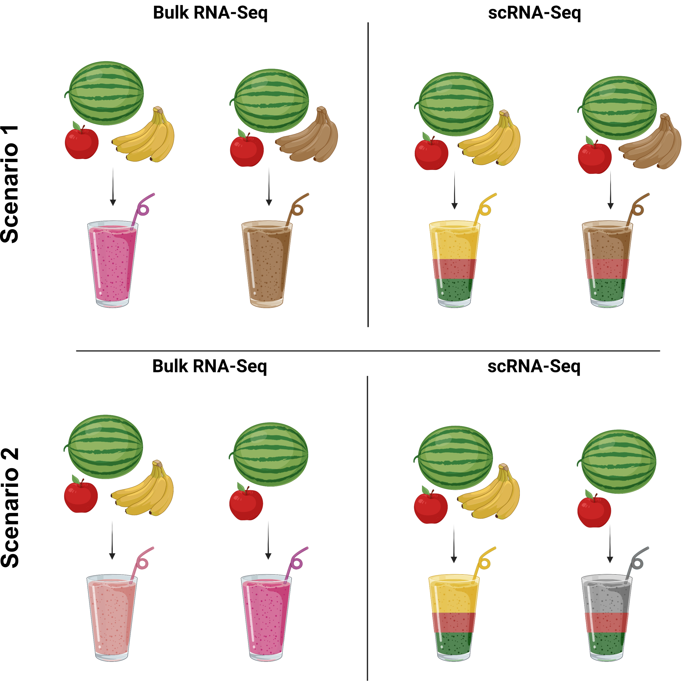

# Introduction to single-cell RNA-seq

## Teaching Materials

This repository contains teaching materials from hbctraining but has been modified to support students enrolled in MMG232: Advanced Bioinformatics at the University of Vermont. The full citation for this work is provided below.

## Description

This repository has materials for an Introduction to single-cell RNA-sequencing data analysis. This unit focuses on how to design a single-cell RNA-seq experiment and how to manage and analyze the data starting from count matrices efficiently. The steps to generate count matrices from raw data will be discussed; however, the steps to create count matrices from raw data (FASTQ files) will not be performed. In this unit, we will use the Seurat package using R/RStudio on VACC Open OnDemand. Working knowledge of R/Rstudio is required.

## Learning Objectives

1. Explain common considerations when designing a single-cell RNA-seq experiment
2. Discuss the steps involved in taking raw single-cell RNA-sequencing data and generating a count (gene expression) matrix
3. Compute and assess QC metrics at every step in the workflow
4. Cluster cells based on expression data and derive the identity of the different cell types present
5. Identify the expression pattern of specific gene(s) at the single cell level

## To begin: Click on the Class Schedule

[Class Schedule](https://github.com/SomenMistri/intro_to_scRNA-seq/tree/main/schedule)

# Part 1

## Why single-cell RNA-seq

Across human tissues, there is an incredible diversity of cell types, states, and interactions. To better understand these tissues and the cell types present, single-cell RNA-seq (scRNA-seq) offers a glimpse into what genes are being expressed at the level of individual cells.

_**Image credit:** courtesy of Dr. Ayshwarya Subramanian_

The single-cell RNA-seq (scRNA-seq) offers significant advantages over the bulk RNA-seq approach while investigating heterogeneous populations of cells. Before scRNA-seq, transcriptome analysis was performed using bulk RNA-seq, a straightforward method for comparing the averages of cellular expression. This method can be a good choice if looking at comparative transcriptomics (e.g., samples of the same tissue from different species) and for quantifying expression signatures in disease studies. It also has the potential for discovering disease biomarkers if you are not expecting or concerned about cellular heterogeneity in the sample. Two scenarios where scRNA-seq outperforms bulk RNA-seq are shown below: 

While bulk RNA-seq can explore differences in gene expression between conditions (e.g., treatment or disease), the differences at the cellular level need to be adequately captured. For instance, in the images below, if analyzed in bulk (left), we would not detect the correct association between the expression of gene A and gene B. However, if we properly group the cells by cell type or cell state, we can see the correct correlation between the genes.

_**Image credit:** Trapnell, C. Defining cell types and states with single-cell genomics, Genome Research 2015 (doi:
https://dx.doi.org/10.1101/gr.190595.115)_

This exciting and cutting-edge scRNA-seq method can be used to:

- explore which cell types are present in a tissue
- identify unknown/rare cell types or states
- elucidate the changes in gene expression during differentiation processes or across time or states
- identify genes that are differentially expressed in particular cell types between conditions (e.g., treatment or disease)
- explore changes in expression among a cell type while incorporating spatial, regulatory, and/or protein information

## Let's analyze a publicly available scRNA-seq dataset
To understand and perform scRNA-seq data analysis, let's use a publicly available dataset with a specific research goal. Please click this [link](https://rupress.org/jem/article/220/1/e20220503/213546/WNT-signaling-in-the-tumor-microenvironment) to go to the journal webpage.

Alternatively, you can access the main text along with the supplemental data (IMPORTANT!!) by clicking [here](https://github.com/SomenMistri/intro_to_scRNA-seq/blob/main/pdf/Article_WNT_signaling_Pancreatic_cancer.pdf).

The human scRNA-seq datasets (count matrices prepared from raw FASTQ data) utilized by the authors are available [here](https://www.ncbi.nlm.nih.gov/geo/query/acc.cgi?acc=GSE155698),
while the mouse scRNA-seq datasets are available [here](https://www.ncbi.nlm.nih.gov/geo/query/acc.cgi?acc=GSM6127792).

Please note that, for this course, we will focus on human scRNA-seq datasets only.

## Research question, Study design, and technical considerations
Please go to the PowerPoint slide to discuss the following:

- Why was this study performed?
- How was the experiment designed to answer the specific research questions?
- What technical factors must be understood to carry out the experiments successfully?

### Citation

To cite material from this course in your publications, please use:

> Jihe Liu, William J. Gammerdinger, Meeta Mistry, Mary E. Piper, & Radhika S. Khetani. (2022, January 6). hbctraining/Intro-to-shell-flipped: Shell and HPC Lessons from HCBC (first release). Zenodo. https://doi.org/10.5281/zenodo.5826091

A lot of time and effort went into the preparation of these materials. Citations help us understand the needs of the community, gain recognition for our work, and attract further funding to support our teaching activities. Thank you for citing this material if it helped you in your data analysis.

---
These materials have been developed by members of the teaching team at the [Harvard Chan Bioinformatics Core (HBC)](http://bioinformatics.sph.harvard.edu/). These are open access materials distributed under the terms of the [Creative Commons Attribution license](https://creativecommons.org/licenses/by/4.0/) (CC BY 4.0), which permits unrestricted use, distribution, and reproduction in any medium, provided the original author and source are credited.

Some materials used in these lessons were derived from work that is Copyright © Data Carpentry (http://datacarpentry.org/). 
All Data Carpentry instructional material is made available under the [Creative Commons Attribution license](https://creativecommons.org/licenses/by/4.0/) (CC BY 4.0).
